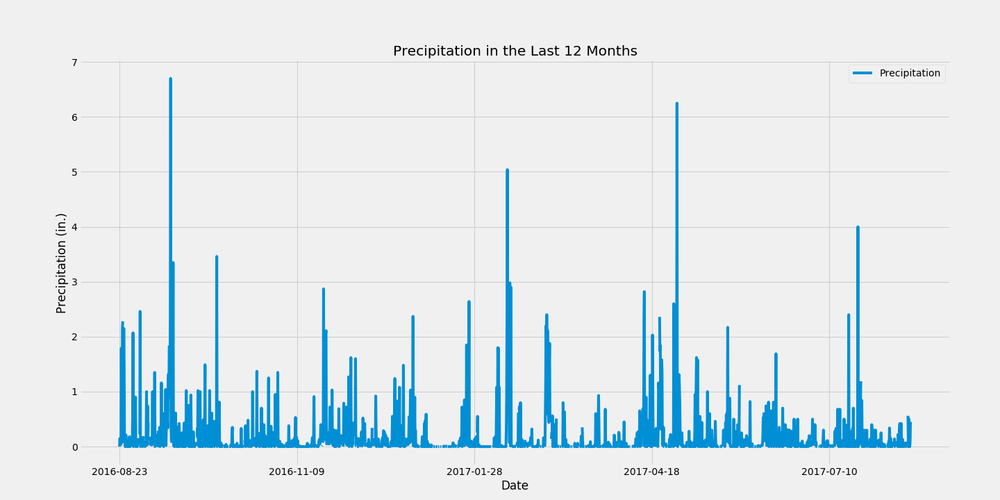

# SQLAlchemy Challenge

## Step 1 - Climate Analysis and Exploration

To begin, I used Python and SQLAlchemy to do basic climate analysis and data exploration of the climate database. 
I randomly chose a start date and end date for my trip, where vacation range is approximately 3-15 days total.
Then, I used SQLAlchemy create_engine to connect to the sqlite database.
Next, I used SQLAlchemy automap_base() to reflect your tables into classes and saved a reference to those classes called Station and Measurement.

## Step 2-Precipitation Analysis

To analyze the precipation data, I took the following steps:

1. Design a query to retrieve the last 12 months of precipitation data.
2. Select only the date and precipitation values.
3. Load the query results into a Pandas DataFrame and set the index to the date column.
4. Sort the DataFrame values by date.
5. Plot the results using the DataFrame plot method

This how the precipitation chart looks like:

## Step 3- Station Analysis
To analyze the stations in the data, I took the following steps:

1. Design a query to calculate the total number of stations.
2. Design a query to find the most active stations.
3. List the stations and observation counts in descending order to answer questions like "Which station has the highest number of observations?"

Design a query to retrieve the last 12 months of temperature observation data (TOBS).

Filter by the station with the highest number of observations.

Plot the results as a histogram with bins=12.